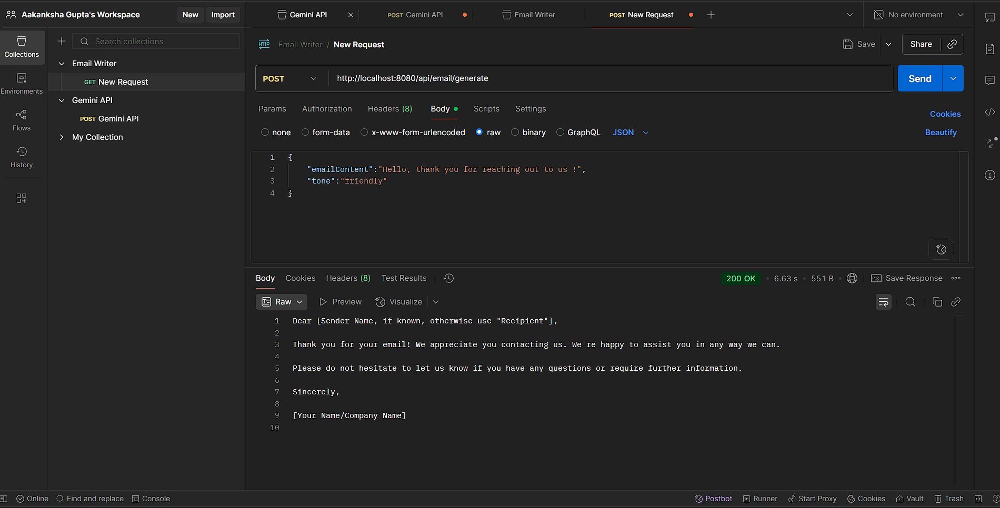
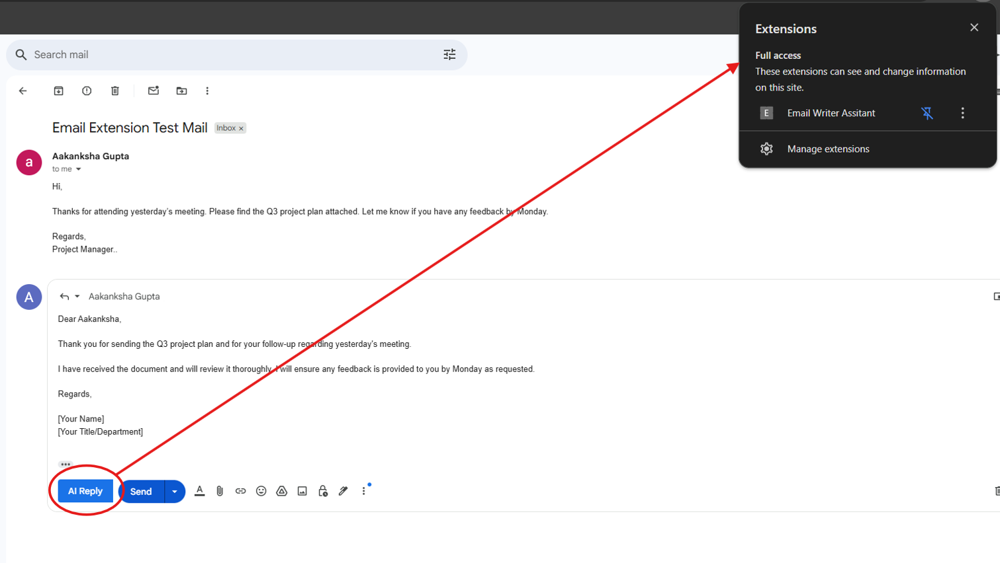
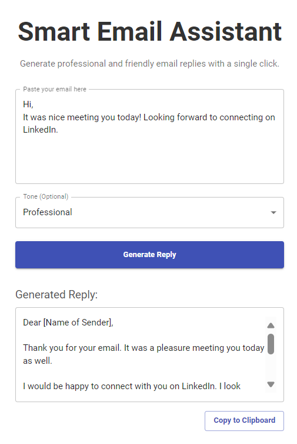
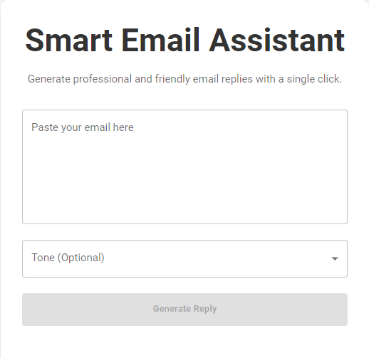
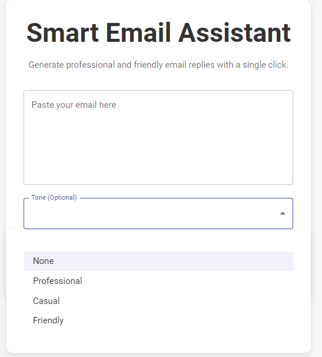

# Smart Email Assistant – AI Gmail Reply Generator

An AI-powered tool that generates **context-aware, tone-customized** Gmail replies using **Google's Gemini API**. Built with **Spring Boot (backend)**, **React + Material UI (frontend)**, and a **Chrome Extension (Manifest v3)** for seamless Gmail integration.

---

## Features
- **AI-Powered Replies** – Generates professional, friendly, or casual replies based on email content.
- **Full-Stack Integration** – Spring Boot backend + React frontend + Chrome extension.
- **Direct Gmail Support** – Injects an **AI Reply** button inside Gmail's compose toolbar.
- **One-Click Response** – Automatically inserts generated reply into Gmail compose box.
- **Responsive UI** – Material UI with theme customization, error handling, and copy-to-clipboard.
- **Dynamic DOM Detection** – MutationObserver for Gmail UI changes.

---

## Project Screenshots

### 📌 Postman API Check


### 📌 Chrome Extension UI


### 📌 Frontend – Main Interface


### 📌 Frontend – Input Section


### 📌 Frontend – Generated Reply View


### 📌 Frontend – Tone Selection


---

## 🛠 Tech Stack
**Backend**
- Spring Boot
- WebClient (API Calls)
- Jackson (JSON Parsing)
- Lombok
- Google Gemini API

**Frontend**
- React
- Material UI
- Axios

**Extension**
- Chrome Extension (Manifest v3)
- JavaScript DOM Manipulation
- MutationObserver

---


## Folder Structure
```
smart-email-assistant/
├── backend/
│   ├── src/
│   │   ├── main/
│   │   │   ├── java/
│   │   │   │   └── com/
│   │   │   │       └── email/
│   │   │   │           └── writer/
│   │   │   │               └── app/
│   │   │   │                   ├── EmailGeneratorController.java
│   │   │   │                   ├── EmailGeneratorService.java
│   │   │   │                   ├── EmailRequest.java
│   │   │   │                   └── EmailWriterSbApplication.java
│   │   │   └── resources/
│   │   │       └── application.properties
│   └── pom.xml
│
├── frontend/
│   ├── src/
│   │   ├── App.js
│   │   ├── App.css
│   │   └── index.js
│   ├── package.json
│   └── public/
│       └── index.html
│
├── extension/
│   ├── content.js
│   ├── manifest.json
│   ├── content.css
│   └── icons/
│       
│       
│      
│
└── README.md
```

---
## ⚙Installation & Setup

### 1️⃣ Clone Repository
```bash
git clone [https://github.com/yourusername/smart-email-assistant.git](https://github.com/yourusername/smart-email-assistant.git)
cd smart-email-assistant
```
2️⃣ Backend Setup (Spring Boot)
Navigate to backend/.
Update application.properties:
gemini.api.url=YOUR_GEMINI_MODEL_URL
gemini.api.key=YOUR_GEMINI_API_KEY

Run the application: Can use IntellijIDEA and run EmailApplicationSb (Need to setup evironment variables, key and url in edit configurations);
```bash
mvn spring-boot:run
```
3️⃣ Frontend Setup (React)
Navigate to frontend/.
Install dependencies:
```bash
npm install
```
Start frontend:
```bash
npm start
```
4️⃣ Chrome Extension Setup
Navigate to extension/.

Open Google Chrome → Extensions → Manage Extensions.

Enable Developer Mode.

Click Load unpacked and select the extension/ folder.

Open Gmail → Compose → Click the AI Reply button.


## API Endpoint
POST /api/email/generate
Request Body
```JSON
{
  "emailContent": "Thank you for your inquiry. We will get back to you soon.",
  "tone": "professional"
}
```
## Response
```
Thank you for reaching out. I appreciate your inquiry and will respond with the requested details shortly.
```
## How It Works?

1.User inputs email content (frontend or Gmail).

2. Spring Boot Backend sends a prompt to the Gemini API.

3. Gemini API generates a reply based on content and tone.

4. The response is returned to the UI or directly inserted into Gmail.


## Future Enhancements
1. Support for multiple languages.

2. Integration with Microsoft Outlook.

3. Offline draft saving.

4. User authentication & personalization.


## Author
Aakanksha Gupta
📧 gupta.aakanksha2003@gmail.com
